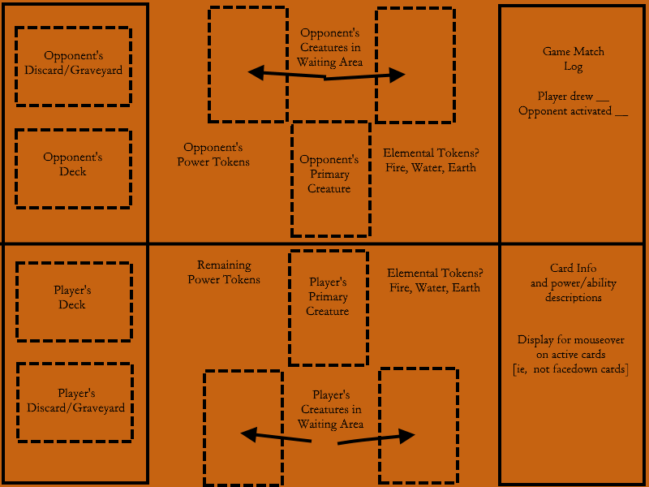
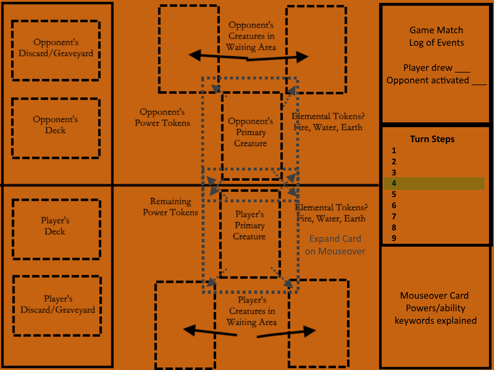
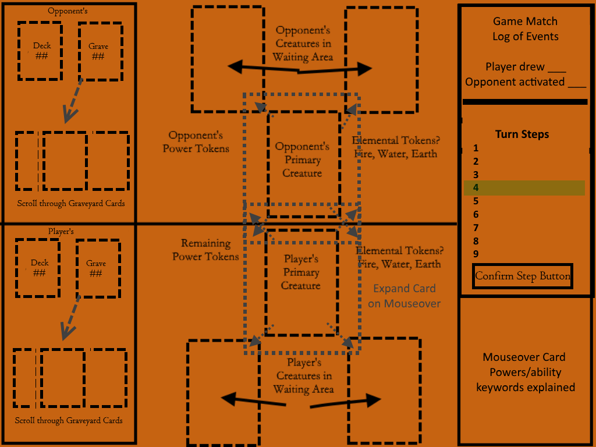
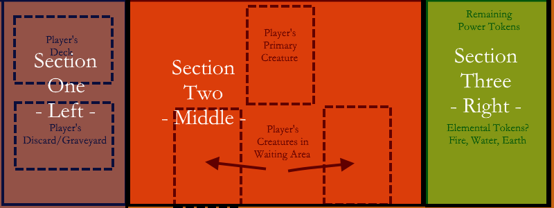
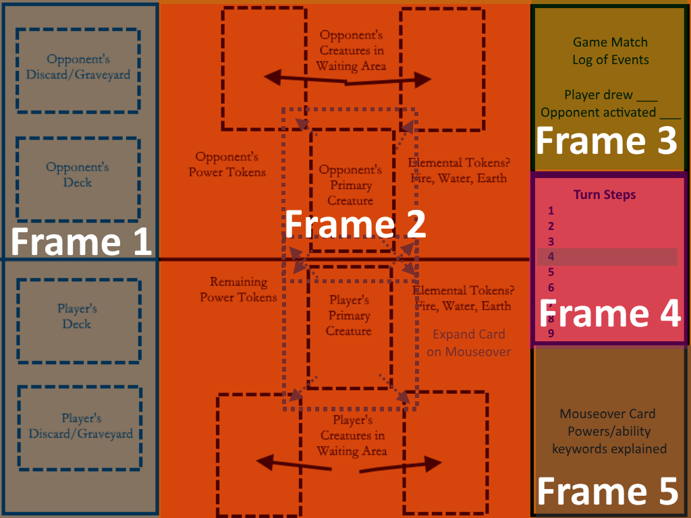

# Card Game (wip)
## User Interface Design

To preserve space on the general README file, the design process for the User Interface will be documented here.

For this project, the plan is to use Scene2D for constructing the user interface. For the overview of the game area including the side areas, there should be three sections laid out horizontally.

Below are some preliminary images of the proposed layout for the gameplay areas.

*Update 04/07/17*: Consider possibility of providing a portrait layout in addition to the landscape layout.

#### Layout Version 1

#### Layout Version 2

#### Layout Version 3

#### Layout Version 4

### Frame Analysis of Interface
Update: The current version to be used for the layout is **Version 4**. This version includes adjustments to the right column to provide more space for the turn tracker by reducing space to the Match Log. Also, the decks and graveyard piles frame were adjusted so that when clicked, the graveyard could be displayed. Even though the most recent version is *Version 4*, the main features are similar enough to *Version 3* that the Frame Analysis will be generally consistent, with minor updates. To be completely true, the other reason for not updating the frame analysis is because I did not want to create another image with the colored highlighted frames.

Version 3: This version includes an updates right-side section for displaying the current step in the turn. The other main aspect is that when a card is viewed, the contents will be displayed on the bottom right with more details in addition to the card scaling slightly.

<!---->

 1. **Frame 1** - Decks and Discard Piles

    The first section will contain the two players' decks and discard piles. The player's own deck/discard piles will be at the bottom of this section, with their opponents displayed at the top.

    Whenever the player needs to draw a card from their deck (start of the game, filling an empty play area slot, etc) an animation will play for moving the card from the top of the deck to the destination. An idea would also to be rotating the card to "flip" it over to display the card. Perhaps to achieve this, the deck of cards could be physical Card objects that can be translated and thus "animated" as being flipped.

    The number of cards in each player's decks and discard piles could be displayed next to each pile.

    Also, player names could probably be displayed in *Frame 1*.

 2. **Frame 2** - Play Area or Battlefield

    The second section is the middle-section containing the cards currently in play. The primary creature slot for each player is centered in the frame and close to the player-opponent divide. Two slots for the waiting area creature cards are below the primary slot.

    When a card is mousedover or touched, the card will scale slightly. The contents of the card will be shown in *Frame 5* along with an explanation of any abilities, keywords, or powers. The scaling may cause an issue with overlap with nearby elements, so this should be considered and checked.

    Any card animations, such as attacking or using their powers, will be displayed in this section as well.

    The remaining number of power tokens and elemental tokens will also be displayed in *Frame 2*. They will be shown most likely as a text counter for each type to reduce space.

 3. **Frame 3** - Match Log

    A small frame in the top left will display the actions of the game. Events in the log can include: drawing cards into play, activating powers, attacking, dealing damage, and using elemental or power tokens. The size of this frame is currently set as 1/3rd of the column, however it could be reduced because it is just some lines of text.

 4. **Frame 4** - Turn Tracker

    In *Frame 4*, the list of steps for each turn as displayed. The current step for each player will be highlighted. It may be necessary for some turns to require approval by the player to continue. In these cases, a button with a countdown timer can be displayed along the bottom of *Frame 4*.

 5. **Frame 5** - Mouseover Contents

    The fifth frame will be used to show the contents of cards that are touched or moused over. It will also provide some explanation for abilities, powers, and keywords to assist the players. The image of the card could be ignored, but it would be a nice touch.

    This frame will need to be examined so that enough space is provided for explanations.

    One note to consider is if events in the log should trigger an update to *Frame 5*. It would be nice, but not immediately necessary.
